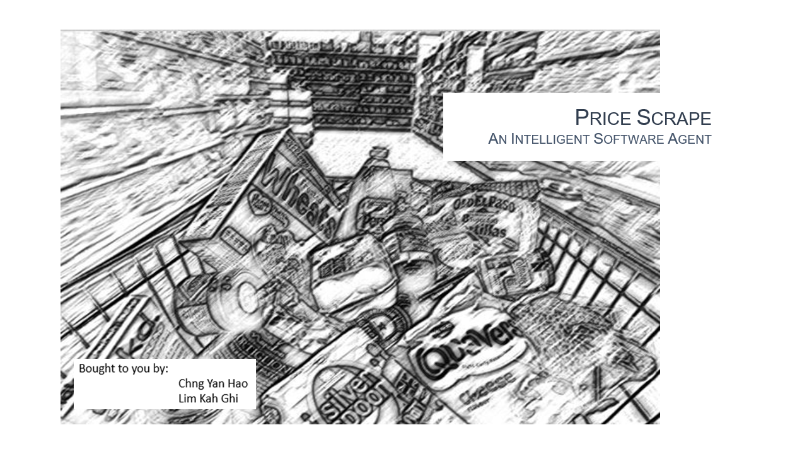

## SECTION 1 : PROJECT TITLE
## Price Scrape - A Web Scraping Tool for Sg Grocery Stores

---

## SECTION 2 : EXECUTIVE SUMMARY

---

## SECTION 3 : CREDITS / PROJECT CONTRIBUTION

| Official Full Name  | Student ID (MTech Applicable)  | Work Items (Who Did What) | Email (Optional) |
| :------------ |:---------------:| :-----| :-----|
| Lim Kah Ghi | A0100172A | from 0% to 100% | E0508022@u.nus.edu |
| Chng Yan Hao | A0024023A | from 0% to 100% | E0529228@nus.edu.sg |

---

## SECTION 4 : INTRODUCTION & DEMO VIDEOS

- View [Intro](https://github.com/RyanChngYanHao/ISA-PM-IPA-2021-01-09-IS02PT-GRP-Price_Scrape/blob/master/Video/UnderConstruction.txt)
- View [Demo](https://github.com/RyanChngYanHao/ISA-PM-IPA-2021-01-09-IS02PT-GRP-Price_Scrape/blob/master/Video/UnderConstruction.txt)

---

## SECTION 5 : USER GUIDE

`Refer to appendix`[QuickUserGuide](https://github.com/RyanChngYanHao/ISA-PM-IPA-2021-01-09-IS02PT-GRP-Price_Scrape/blob/master/ProjectReport/QuickUserGuide.pdf) `in Github Folder: ProjectReport`

-	Download PriceScrape.zip
-	Internet connection required
-	Python 3.7.6
-	Packages: tagui, tkinter, os, date, re, schedule, time, pandas, nltk, nltk (punkt & stopwords) & PIL

### Recommended:
-	Windows 10
-	Google Chrome Browser
-	Python 3.7.6 & above

---
## SECTION 6 : PROJECT REPORT / PAPER

`Refer to`[ProjectReport](https://github.com/RyanChngYanHao/ISA-PM-IPA-2021-01-09-IS02PT-GRP-Price_Scrape/blob/master/ProjectReport/UnderConstruction.txt) `in Github Folder: ProjectReport`

**Recommended Sections for Project Report / Paper:**
- Executive Summary
- Problem Description
- Software Agent System
- Solution
- Conclusions & References

---
## SECTION 7 : MISCELLANEOUS

`Refer to Github Folder: Miscellaneous`
- CodingPhases.zip (for developers who are interested to build similar tool from scratch)
- PriceScrape.png
- ExecutiveSummary.png

---

**Special thanks to [NUS-ISS](https://www.iss.nus.edu.sg "Institute of Systems Science, National University of Singapore") lecturers in [Intellgient Software Agents (ISA)](https://www.iss.nus.edu.sg/executive-education/course/detail/practice-module-for-intelligent-software-agents "Intellgient Software Agents"), making this possible.**
